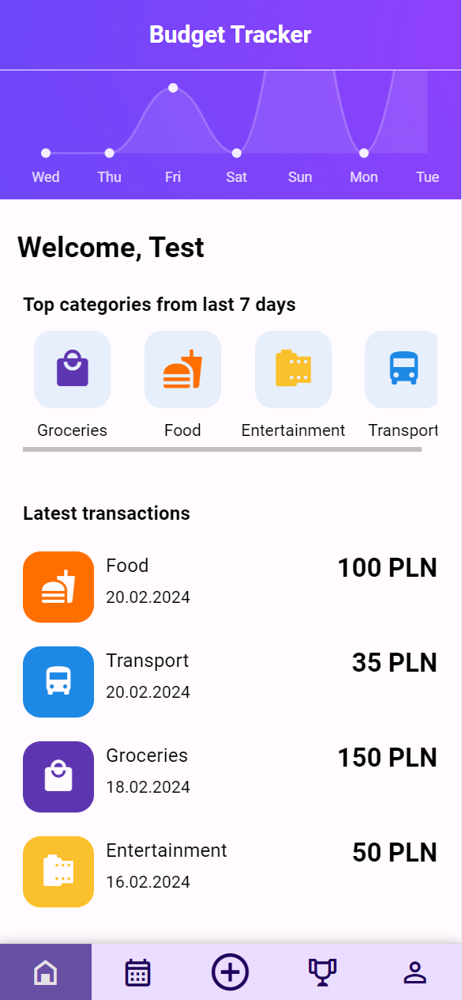
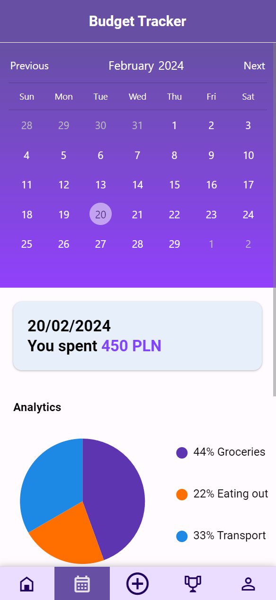
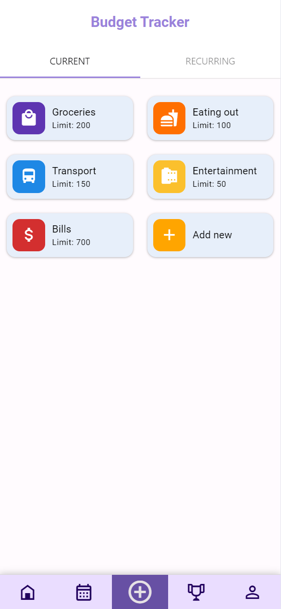
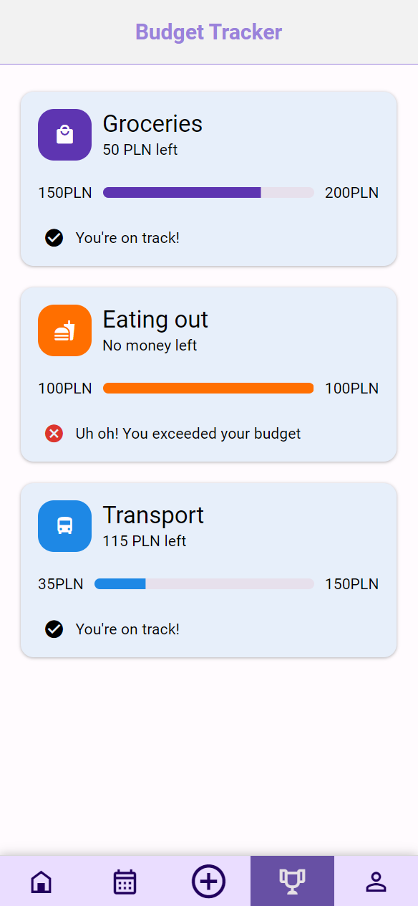

# Budget Tracker

<!-- TOC -->
* [Budget Tracker](#budget-tracker)
  * [Features](#features)
  * [Getting Started](#getting-started)
    * [Prerequisites](#prerequisites)
    * [Installation](#installation)
    * [Running the App](#running-the-app)
  * [Screenshots](#screenshots)
    * [Home Screen](#home-screen)
    * [Calendar View](#calendar-view)
    * [Adding Expenses](#adding-expenses)
    * [Achievements](#achievements)
<!-- TOC -->

Budget Tracker is a user-friendly mobile application designed to help individuals manage their finances effortlessly. Built with React Native, this app offers cross-platform compatibility, ensuring a seamless experience for both Android and iOS users. With Budget Tracker, users can track their spending, set budgeting goals, and visualize their financial habits through intuitive graphs and summaries.

## Features
- **Expense Tracking**: Log every expenditure as it happens and categorize expenses for easy analysis.
- **Budget Setting**: Set monthly or custom period budgets for different categories and monitor your adherence to those limits.
- **Recurring Expenses**: Add recurring expenses to your budget to account for regular payments and subscriptions.
- **Visual Reports**: Get insights into your spending habits with charts and graphs that break down your finances.
- **Past Transactions**: View your transaction history with a calendar to understand your spending patterns and identify areas for improvement.
- **Secure Data**: Your financial data is stored securely and encrypted to ensure privacy and security.
- **Cross-Platform**: Budget Tracker is built with React Native, making it compatible with both Android and iOS devices.

## Getting Started
### Prerequisites
Before you install Budget Tracker, ensure you have the following installed on your system:

- Node.js ([nvm](https://github.com/nvm-sh/nvm) is recommended for managing multiple Node versions)
- npm or yarn

### Installation
Clone the repository:
```bash
git clone https://github.com/your-username/budget-tracker.git
```

Navigate to the project directory:
```bash
cd budget-tracker
```

Install the dependencies:
```bash
npm ci
```

### Running the App
To run the Budget Tracker app on your local machine, use the following commands:
```bash
expo start
```
And select the appropriate option to run the app on an emulator or physical device.

## Screenshots

### Home Screen



### Calendar View



### Adding Expenses


### Achievements


